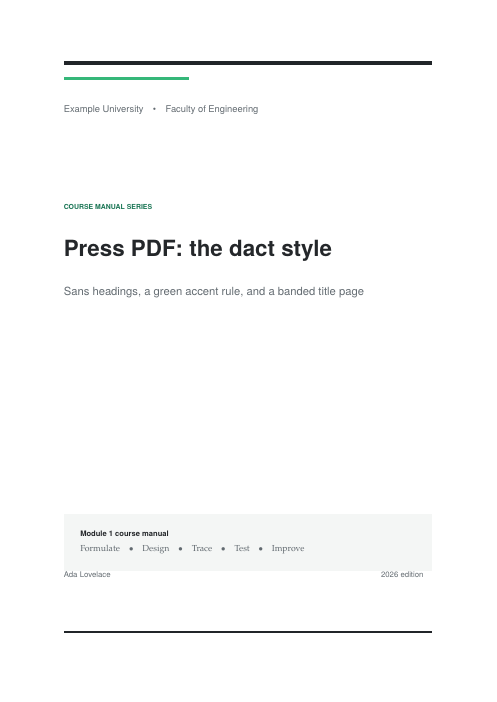
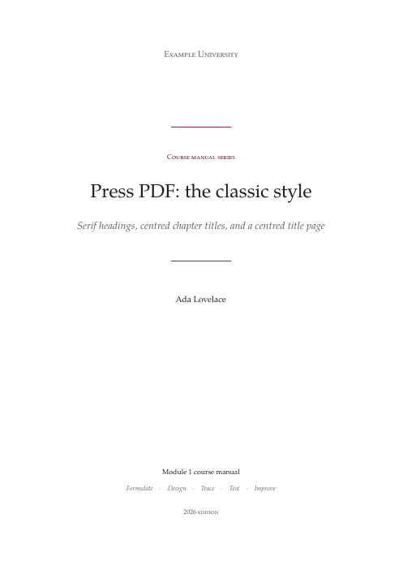
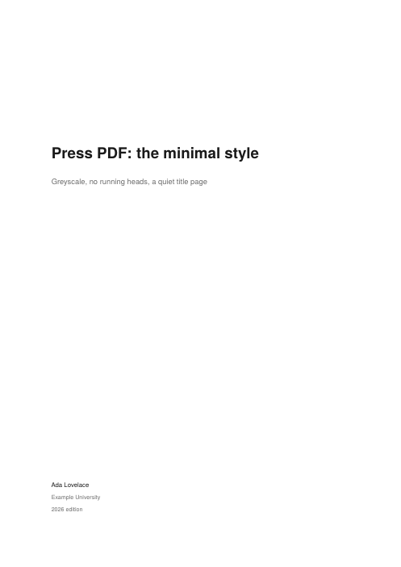
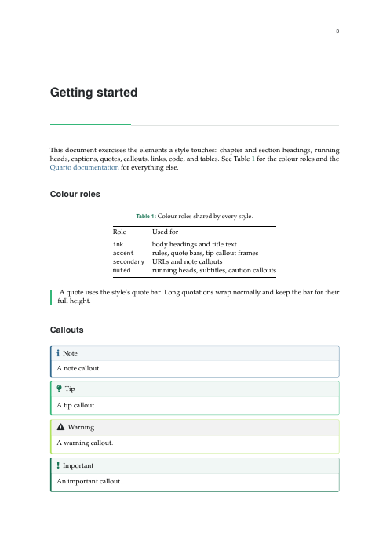
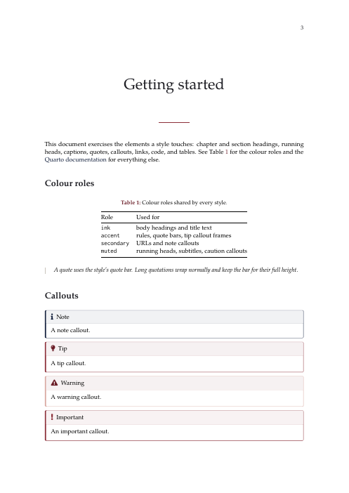
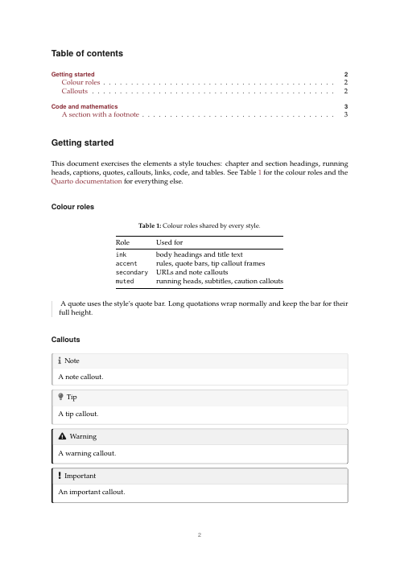

# quarto-pdf

A Quarto PDF format with selectable styles. One extension gives you a
typeset KOMA-Script layout (fonts, margins, wrapped code, clamped figures,
coloured callouts) and a designed title page. Pick the look with a single
option.

| `dact` | `classic` | `minimal` |
|:------:|:---------:|:---------:|
|  |  |  |
|  |  |  |

## Install

```bash
quarto add brenobeirigo/quarto-pdf
```

This copies the extension into `_extensions/brenobeirigo/press/`. Update it
later with `quarto update brenobeirigo/quarto-pdf`.

## Use

Replace `pdf` with `press-pdf`:

```yaml
format:
  press-pdf: default
```

That renders with the `dact` style. Choose another style and fill in the title
page under `press`:

```yaml
format:
  press-pdf:
    press:
      style: classic
      cover:
        institution: [Example University, Faculty of Engineering]
        series: Course manual series
        label: Module 1 course manual
        tagline: [Formulate, Design, Trace, Test, Improve]
        edition: 2026 edition
```

Every regular `pdf` option (`toc`, `mainfont`, `geometry`, `documentclass`,
`include-in-header`, and so on) still works under `press-pdf` and overrides
the defaults below.

## Styles

| Style     | Headings                     | Running heads           | Title page                            |
|-----------|------------------------------|-------------------------|---------------------------------------|
| `dact`    | sans, green accent rule      | chapter left, page right | banded, left-aligned, label box       |
| `classic` | serif, centred chapter titles | italic, no rule         | centred, burgundy rules, small caps   |
| `minimal` | sans, no decoration          | none; page number centred | quiet, left-aligned                  |

### Your own style

Point `style` at a `.tex` file, relative to the project or document:

```yaml
press:
  style: styles/house.tex
```

The file is loaded after the shared layout, so it can use the colour roles and
title-page macros listed below. Copy one of the files in
`_extensions/brenobeirigo/press/styles/` as a starting point.

## Options

All options live under the `press` key.

| Option          | Default | Description |
|-----------------|---------|-------------|
| `style`         | `dact`  | `dact`, `classic`, `minimal`, or a path to a `.tex` file. |
| `colors.<role>` | style's | Six-digit hex colour for a role. Quote values that start with `#`. |
| `cover.<field>` | empty   | Title-page text. Markdown is allowed. A list is joined with the style's separator. |

### Colour roles

| Role           | LaTeX name         | Typical use |
|----------------|--------------------|-------------|
| `ink`          | `pressink`         | headings and title text |
| `strong`       | `pressstrong`      | heavy rules, warning callouts |
| `accent`       | `pressaccent`      | accent rules, quote bars |
| `accent-dark`  | `pressaccentdark`  | internal links, caption labels |
| `accent-light` | `pressaccentlight` | light callout frames |
| `secondary`    | `presssecondary`   | URLs, note callouts |
| `muted`        | `pressmuted`       | running heads, subtitles |
| `rule`         | `pressrule`        | hairlines |
| `soft`         | `presssoft`        | tinted boxes |

The LaTeX names are also available in your own `include-in-header` code.

### Cover fields

| Field         | Macro               | Notes |
|---------------|---------------------|-------|
| `title`       | `\presstitle`       | Falls back to the document `title`. Use a trailing `\` for a line break. |
| `subtitle`    | `\presssubtitle`    | Falls back to the document `subtitle`. |
| `author`      | `\pressauthor`      | Falls back to the document authors. |
| `institution` | `\pressinstitution` | |
| `series`      | `\pressseries`      | |
| `label`       | `\presslabel`       | |
| `tagline`     | `\presstagline`     | |
| `edition`     | `\pressedition`     | |

In a custom style, `\presstitlefield`, `\presssubtitlefield` and
`\pressauthorfield` apply the fallbacks. `\pressifset{\macro}{...}` and
`\pressifsubtitle{...}` print their content only when the field is set, and
`\presssep` is the list separator.

A cover title with a manual line break:

```yaml
press:
  cover:
    title: |
      Computational thinking\
      and algorithm design
```

## Defaults

| Option          | Value |
|-----------------|-------|
| `pdf-engine`    | `lualatex` |
| `documentclass` | `scrreprt` (`fontsize=10.5pt`, `numbers=noenddot`, `chapterprefix=false`) |
| `papersize`     | `a4`, margins 26/29/27/27 mm |
| `mainfont`      | TeX Gyre Pagella |
| `sansfont`      | TeX Gyre Heros |
| `monofont`      | Inconsolata (`Inconsolatazi4`) |
| `toc`           | `true`, depth 2 |

The fonts ship with TeX Live. With TinyTeX, install them once:

```bash
tlmgr install tex-gyre inconsolata
```

## Books with chapters outside the project

Quarto only resolves `format: press-pdf` for files inside the project
directory. If a book lists chapters such as `../chapters/intro.qmd`, keep
`format: pdf`, set the page options yourself (see [Defaults](#defaults)), and
load the filter by path. The styles, colours and cover fields work the same:

```yaml
filters:
  - ../_extensions/brenobeirigo/press/press.lua

format:
  pdf:
    pdf-engine: lualatex
    documentclass: scrreprt
    mainfont: "TeX Gyre Pagella"
    sansfont: "TeX Gyre Heros"
    press:
      style: dact
```

## Requirements

- Quarto 1.4 or later.
- A KOMA-Script class: `scrreprt` (default), `scrbook` or `scrartcl`. Other
  classes compile, but the heading and running-head styling is skipped.

## Try the examples

```bash
cd example
quarto add .. --no-prompt
quarto render dact.qmd
quarto render classic.qmd
quarto render minimal.qmd
```

`minimal.qmd` also shows `documentclass: scrartcl` and a colour override.

## License

MIT
